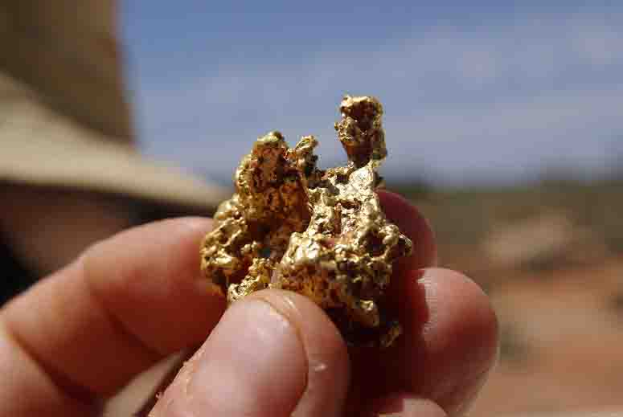

# Physical Mining

We are currently in negotiations with some mining teams in various locations around the US and looking to connect with more so we can help them grow and continue to add to our portfolio, we will be partnered with teams all over to help them fund and manage their operations. We have also started the necessary steps to begin our first placer mining operation in Montana in the Spring of 2023 and will continue to expand that as well. If you are a gold or precious metal mining company or team and you are looking for your next investment partner, please reach out to the team anytime via [**Telegram**](https://t.me/DefiGold\_Official) or [**Email**](mailto:team@defigold.io) _(More Details Coming Soon)_

<figure><figcaption></figcaption></figure>
